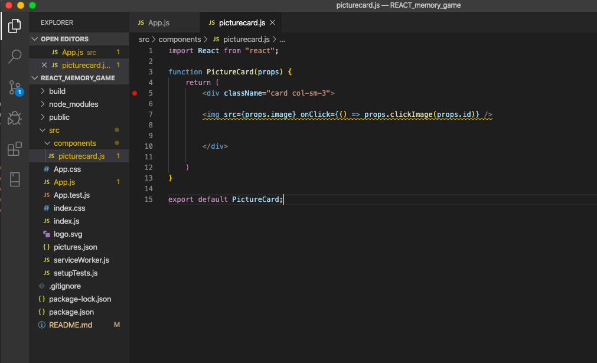
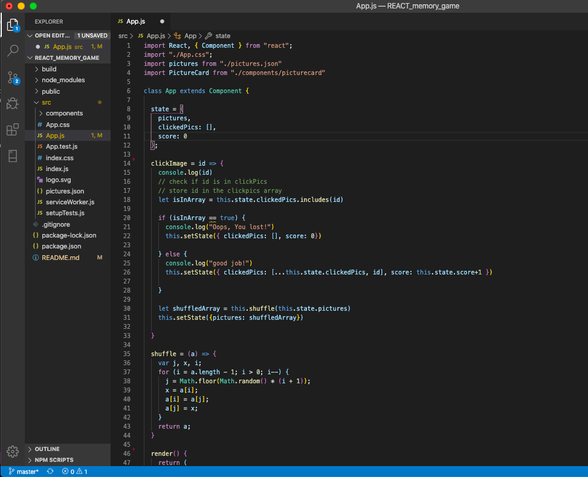

# REACT Clicky Game
React clicking-game web application

## Deployed Heroku Application
https://cryptic-thicket-80879.herokuapp.com/

### GH Pages URL: https://pmahalan.github.io/REACT_memory_game/

My purpose in building this application was to create a website in REACT which operated based on the state of various components. I created a component called "PictureCard", which dealt with each of the images on my app's homepage, as well as the on-click events associated with them. 

In the App.js file of the application, I wrote code which provided for the functionality of the clicky game. Upon the user clicking on any particular image, that image is stored in an array called clickedPics. With each subsequent click by the user, the code checks to see if the user repeats a click on an image which is already stored in that array. Each time the user clicks on a different image than before, their score is incremented by 1, and a congratulatory message is displayed in the console log. If the user clicks on an image which has already been clicked on, however, their score is reset to zero, and the clickedPics array is reset to being empty.

